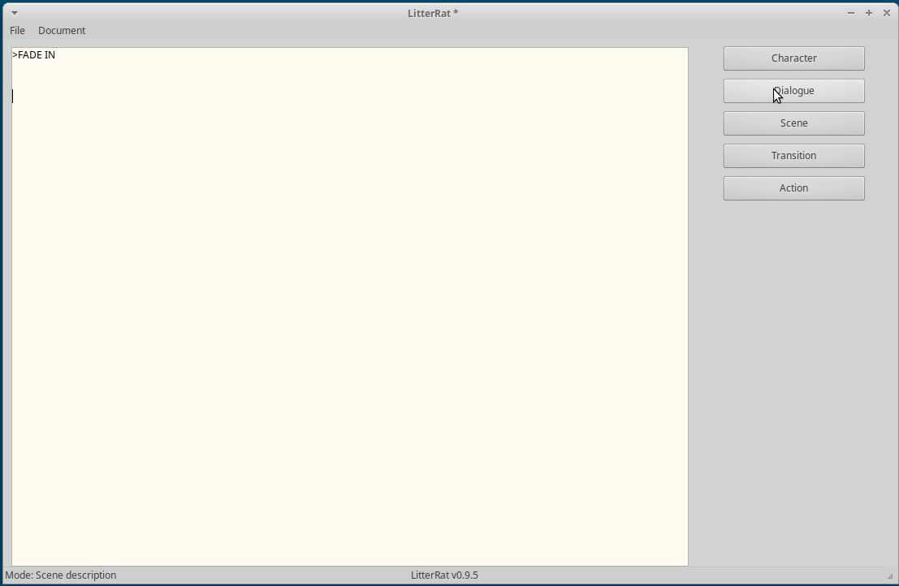

# LitterRat
Text editor for Fountain markdown

Simple, lightweight text editor for Windows & Linux. The editor has quick access buttons to format your text as Characters, Scenes, etc.
The script can then be exported as formatted HTML, to be printed as a PDF.

[Download the Linux version here](https://github.com/cyberfilth/LitterRat/releases/download/v0.9.5/LitterRat_Linux.zip)

[Download the Windows version here](https://github.com/cyberfilth/LitterRat/releases/download/v0.9.5/LitterRat_Windows.zip)
